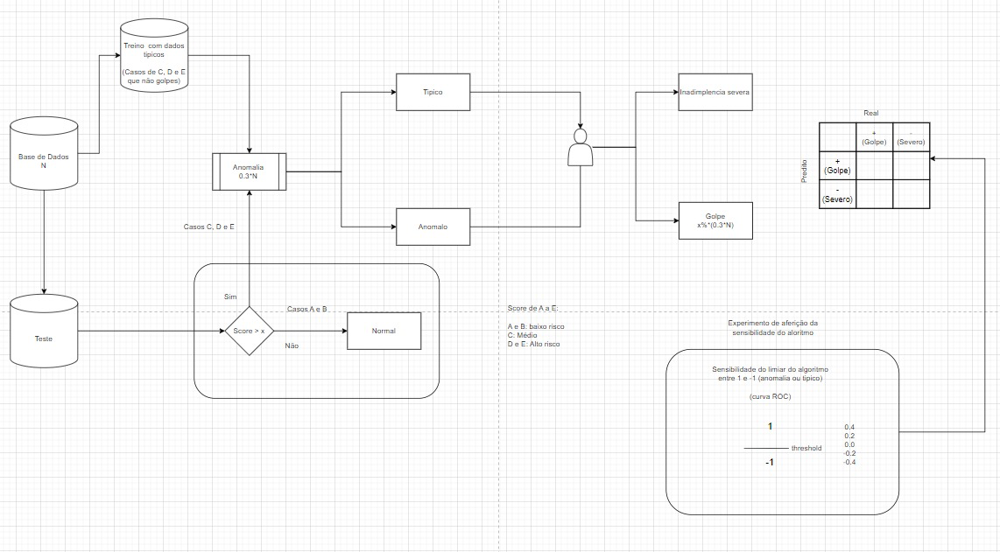

# Detecção de Fraudes Financeiras na Concessão de Crédito a Empresas de Bens de Consumo utilizando Isolation Forest

Este repositório apresenta uma metodologia criada para detectar fraudes financeiras na concessão de crédito utilizando o algoritmo **Isolation Forest**. A metodologia foi desenvolvida a partir de um dataset original, passando pela transformação dos dados e criação de novas variáveis que fazem sentido para a análise de risco de crédito.

## Metodologia



## Contexto

A **CISP (Central de Informações São Paulo)** é uma associação sem fins lucrativos, fundada em 1972, cuja missão é oferecer soluções exclusivas para a análise de risco de crédito, contribuindo ativamente para o desenvolvimento econômico nacional. A entidade é composta por 192 grandes indústrias de produtos de largo consumo, distribuídas em oito segmentos — Alimentos, Bebidas, Higiene Pessoal e Cosméticos, Papel, Papelaria, Utilidades Domésticas, Eletroeletrônicos e Produtos de Limpeza —, representando aproximadamente 8% do Produto Interno Bruto (PIB) brasileiro.

A atuação da CISP é direcionada exclusivamente a clientes pessoas jurídicas, totalizando cerca de 1,4 milhão de CNPJs. As informações comerciais, fornecidas periodicamente pelos associados, são enriquecidas com dados provenientes de fontes públicas e privadas. A partir dessa base de dados, é gerada uma classificação de risco de performance (score de crédito), que categoriza os clientes nas faixas A e B (baixo risco), C (médio risco) e D e E (alto risco). Atualmente, cerca de 1.700 profissionais das áreas de crédito e cobrança utilizam os relatórios da CISP, acessando-os manualmente, por meio de APIs ou por motores de crédito automatizados.

Fóruns técnicos promovidos pela CISP revelaram oportunidades de aprimoramento nos modelos tradicionais de análise de risco, especialmente na identificação de comportamentos atípicos que possam indicar possíveis fraudes. Casos emblemáticos incluem crescimento anormal no volume de compras, alterações cadastrais recentes e inconsistências entre a data de fundação da empresa e seu tempo efetivo de atividade. Dados preliminares apontam que aproximadamente 148 mil empresas — cerca de 15% da base de clientes — encontram-se em situação de inadimplência severa, acumulando dívidas superiores a R$ 2,1 bilhões.

Diante desse contexto, o objetivo desta metodologia é propor e validar uma metodologia baseada em inteligência artificial, utilizando o algoritmo não supervisionado **Isolation Forest** para a detecção de anomalias que possam sinalizar potenciais fraudes financeiras.

## Desenvolvimento

### Identificação de Padrões Comportamentais

A CISP fomenta a interação contínua entre os profissionais de crédito e cobrança das empresas associadas. Esses fóruns têm revelado padrões comportamentais associados a potenciais clientes fraudulentos. Entre os principais sinais:

1. Alterações cadastrais suspeitas
2. Redução repentina do score de crédito
3. Inconsistência entre tempo de atividade e fundação
4. Picos no número de consultas
5. Crescimento atípico no volume de compras e débitos
6. Expansão do número de associadas impactadas por inadimplência

Esses comportamentos, quando monitorados em conjunto, contribuem para a construção de modelos preditivos mais eficazes na detecção de fraudes.

### Materiais e Ferramentas

A metodologia foi desenvolvida em **Google Colab**, com Python 3. As principais bibliotecas utilizadas foram:

- `pandas`, `numpy` — manipulação de dados
- `hashlib` — anonimização com SHA-256
- `matplotlib`, `seaborn` — visualização
- `scikit-learn` — algoritmo Isolation Forest

### Compreensão dos Dados

O dataset utilizado contém **2.191.293 observações** e **19 variáveis**, representando **647.132 CNPJs distintos**, sem duplicatas.

### Criação de Novas Variáveis

Com base nas hipóteses dos especialistas, foram criadas variáveis categóricas auxiliares para apoiar na detecção de comportamentos suspeitos.

## 📌 Objetivos

- Identificar padrões atípicos em dados de crédito empresarial
- Aplicar o algoritmo Isolation Forest para detectar possíveis fraudes
- Propor um modelo replicável de análise de risco com IA

## 🧰 Tecnologias utilizadas

- Python 3.10+
- Scikit-learn
- Pandas
- Matplotlib / Seaborn
- Jupyter Notebook

## 📁 Estrutura do projeto

```
fraudes-financeiras-isolation-forest/
├── data/                   # Conjuntos de dados (raw, processed)
├── notebooks/              # Notebooks de análise e modelagem
├── reports/                # Resultados e visualizações
├── requirements.txt        # Dependências do projeto
└── README.md
```

## 🚀 Como executar

1. Clone o repositório:
   ```bash
   git clone https://github.com/seu-usuario/fraudes-financeiras-isolation-forest.git
   cd fraudes-financeiras-isolation-forest
   ```

2. Crie e ative um ambiente virtual:
   ```bash
   python -m venv .venv
   source .venv/bin/activate  # ou .venv\Scripts\activate no Windows
   ```

3. Instale as dependências:
   ```bash
   pip install -r requirements.txt
   ```

4. Execute o script principal:
   ```bash
   python main.py
   ```

5. Ou, se preferir, abra os notebooks em JupyterLab:
   ```bash
   jupyter lab
   ```

## 🧠 Algoritmo: Isolation Forest

O **Isolation Forest** é um algoritmo de detecção de anomalias baseado na ideia de isolar observações. Ele é eficiente para grandes volumes de dados e ideal para detectar fraudes sem rótulos prévios.

## 🔒 Segurança e Privacidade

Todos os dados utilizados neste estudo foram **anonimizados com SHA-256**, garantindo conformidade com as diretrizes de privacidade e segurança da informação.

## 📝 Licença

Este projeto está licenciado sob a [MIT License](LICENSE).

---

**Autor:** João Marcelo Cattaldo Amorim  
**Contato:** [marcelo@cisp.com.br](mailto:marcelo@cisp.com.br)
